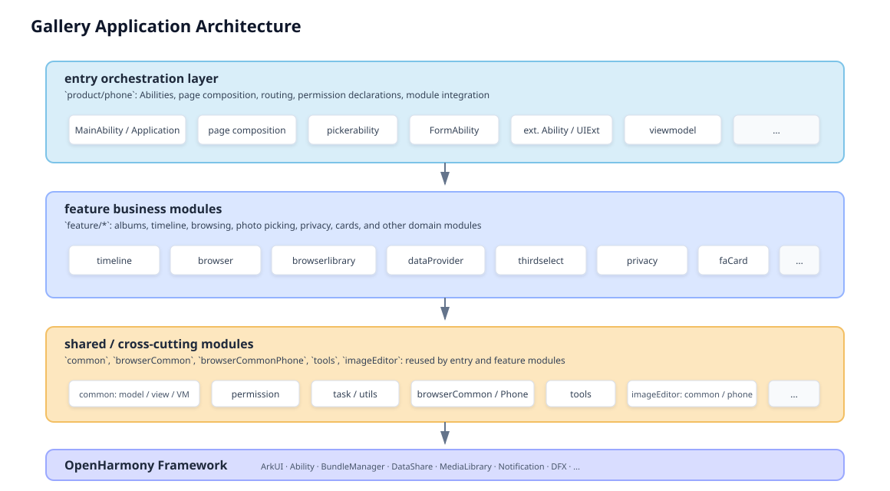

# photos

## Introduction

The Gallery app is a pre-installed system application in the OpenHarmony standard system. It provides core gallery capabilities including album grid and timeline browsing, photo and large-image browsing with enhanced features, static image editing (including continuation editing, one-click restore, comparison, and basic editing), PhotoPicker, service cards, settings and privacy statement pages, open-source materials, and extension capabilities.

## Core Features

1. **Home page and grid browsing**: supports browsing photos and videos through album grid and timeline views, providing the primary gallery entry experience. This includes standard day-view browsing, scrolling, tapping the status bar to return to the top, top multi-select buttons, and long-press multi-select interactions, together with grid operations such as delete, select all, slide-to-select, move to album, and slideshow duration settings.
2. **Photo / large-image browsing**: supports large-image title display and an immersive browsing experience, with gesture interactions such as swipe switching, double-tap zoom, pinch zoom, pull-down to return, and swipe-up for details. It also provides large-image menu actions such as favorite, edit, and delete, along with top actions including move to album, slideshow, set as wallpaper, and rename.
3. **Video playback**: supports video playback, pause, mute playback, seek playback, dragging the progress bar, speed control, and portrait/landscape switching, covering the basic playback needs for short videos and local media content in gallery scenarios.
4. **Album operations**: support the display of preset albums and the recent deletion page, provide common album management functions such as creating albums, renaming, deleting, adding photos, and sorting photos within the album, and offer the recent deletion page, clearing deletion, and restoration.
5. **Static image editing**: supports crop, adjust, annotation, mosaic, save, compare, undo/restore, and one-click restore, meeting common editing and recovery needs for static images.
6. **PhotoPicker**: supports PhotoPicker customization, including single-select, multi-select, album switching, large-image and video preview, selection order, latest photos/videos, camera entry, original-image selection, file format, and quantity settings, making it suitable for both system and third-party selection flows.
7. **Desktop cards**: supports displaying photos on desktop cards, provides a card editor page, and allows either a single photo or an album to be selected for display, enabling quick access to gallery content from the desktop.
8. **System adaptation**: supports gallery rotation, dark mode, and saving images from third-party applications into the gallery, improving compatibility and experience consistency across different system features and cross-application scenarios.

## Software Architecture

This project is an ArkTS application organized as a **multi-module HAP/HSP project**, with all modules orchestrated through `build-profile.json5`.

### Position of the phone app in the overall architecture

- **Phone entry HAP**: `product/phone` is the `entry` module (module name: `phone_photos`). It declares the main Ability, page routing, permissions, and dependencies on other HSP/HAR modules. The main process and primary UI flow of the Gallery app start here.
- **Business capability layering**: most album, timeline, image browsing, and photo selection features are implemented in `feature/*` and `common`. The entry module keeps itself relatively thin by consuming local ohpm packages such as `@ohos/common` and `@ohos/browserlibrary`, resolved through `oh-package.json5` and module dependency declarations.
- **Phone-specific browsing adaptation**: `browserCommon` contains cross-device browsing logic, while phone-specific differences are concentrated in `browserCommonPhone` (for example layout, gestures, and controller wiring on phones), working together with `feature/browser` and `feature/browserlibrary`.
- **Phone-side image editing**: the main static image editing path is located in the `imageEditor` subproject. The phone product target is `imageEditor/product/editor_phone`, integrated together with `imageEditor/common` (algorithm bridges, SDK integration, and related shared logic).

### Architecture Diagram

- `product/phone` acts as the **entry orchestration layer**, responsible for Abilities, page composition, routing, permission declarations, and module integration.
- `feature/*` carries the main **business capability modules**, such as albums, timeline, browsing, photo picking, privacy, and cards.
- `common`, `browserCommon`, `browserCommonPhone`, `tools`, and `imageEditor` provide **shared models, reusable UI / ViewModel logic, browsing infrastructure, utility code, and editing capabilities**.
- All modules depend on **OpenHarmony system frameworks** such as ArkUI, Ability, DataShare, and Media Library.



### Other shared layers

- **Application-level configuration**: `AppScope` (`bundleName`, version, icon, and global configuration).
- **Shared foundation**: `common` (data models, permissions, tasks, reusable UI / VM) and `tools` (general utilities).
- **Feature module directories**: `feature` is split by domain, including `browser`, `browserlibrary`, `timeline`, `dataProvider`, `thirdselect`, `formAbility`, `faCard`, `extensions`, and `privacy`.
- **Build and signing**: `hvigorfile.ts` and `hvigor/` in the root;

---

## Directory Guide

### 1. Project root directory

```text
applications_photos/
├── AppScope/                      # App-level app.json5 and related config
├── product/phone/                 # Phone/tablet entry: main HAP, Abilities, page entry
├── common/                        # Global shared logic: models, permissions, views, VM, etc.
├── feature/                       # Business HSP/HAR modules
├── browserCommon/                 # Shared browsing logic
├── browserCommonPhone/            # Phone-specific browsing differences and controllers
├── imageEditor/                   # Image editing subproject
├── tools/                         # Utility module
├── demo/                          # Sample projects, such as PhotoPicker demo
├── signature/                     # Signing certificates and profiles
├── hvigor/, hvigorfile.ts         # Hvigor build configuration
├── build-profile.json5            # Modules, SDK versions, signing configuration
└── oh-package.json5               # Root dependencies; submodules also have their own oh-package.json5
```

### 2. Phone entry module `product/phone`

This is the main gallery app installed on the phone, corresponding to the generated **entry HAP** from this directory. Main source path: `product/phone/src/main/`.

```text
product/phone/src/main/
├── module.json5                     # Module type, mainElement, permissions, dependent HSPs
├── resources/                       # Strings, media, themes, page profiles such as main_pages
└── ets/
    ├── Application/                 # App-level lifecycle such as AbilityStage
    ├── MainAbility/                 # Main UI: album tabs, grids, timeline entry, image browser container
    │   ├── MainAbility.ets
    │   ├── PrivacyStatementAbility.ets
    │   └── view/                    # Main flow pages and child components
    ├── FormAbility/                 # Service cards / desktop cards
    ├── pickerability/               # System photo picker / PhotoPicker extensions
    ├── RecentAbility/               # "Recent" related UI extensions
    ├── DeleteAbility/               # Delete-related UI extensions and pages
    ├── SaveAbility/                 # Save-related UI extensions and pages
    ├── DefaultAlbumNameAbility/     # Default album naming related UI extensions
    ├── galleryCleanupAbility/       # Gallery cleanup entry and related pages
    ├── SettingCardDataShareAbility/ # Ability for settings card data sharing
    ├── AuthExtension/               # Authentication extension
    ├── BackupExtension/             # Backup extension
    ├── MusicAbility/                # Media/music related service stub
    ├── viewmodel/                   # Page-level VM classes in the entry module
    └── resources/                   # Embedded resources such as lottie/json
```

**Suggested reading order for phone-side code**: `Application` -> `MainAbility` (including the main tabs and `*Loader` page composition under `view/`) -> extension points such as `pickerability` and `FormAbility` as needed. Most business implementation details are imported from `common` and `feature/*`.

### 3. Shared module `common`

Path: `common/src/main/ets/`. A large portion of phone-side pages and logic depend on the models and reusable components defined here.

```text
common/src/main/ets/
├── default/
│   ├── model/                     # Data models for media items, albums, browsing, etc.
│   ├── view/, viewmodel/          # Reusable UI and state management
│   ├── permission/                # Permission request and explanation wrappers
│   ├── task/                      # Async tasks and scheduling
│   ├── utils/, access/, config/   # Utilities, access wrappers, configuration
│   └── interface/                 # External or inter-module interface definitions
```

### 4. Feature modules `feature/*`

Path: `feature/<module>/src/main/ets/`. The modules below are commonly involved in the phone gallery flow:

| Directory | Typical responsibility on phone |
|------|------------------|
| `feature/browser` | Gallery browsing implementation and related packaging logic |
| `feature/browserlibrary` | Browsing library consumed by other apps or entry modules |
| `feature/timeline` | Timeline views and album/photo grid capabilities |
| `feature/dataProvider` | External media data provider and related data channel logic |
| `feature/thirdselect` | Third-party photo selection and system picker integration |
| `feature/formAbility` | Feature-side implementation for form / extension Ability logic |
| `feature/faCard` | Service card data and related logic |
| `feature/privacy` | Security and privacy capabilities |
| `feature/extensions` | Aggregated extension points |

### 5. Shared browsing layers `browserCommon` and `browserCommonPhone`

- **`browserCommon`**: shared browsing logic across device types, including reusable components and pipelines.
- **`browserCommonPhone`**: phone-specific controllers, layout, and interaction differences. It works together with `feature/browserlibrary` to deliver the large-image browsing experience.

### 6. Phone-side image editing `imageEditor`

```text
imageEditor/
├── common/                        # Shared editor core logic, native bridges, SDK integration
└── product/
    └── editor_phone/              # Phone editor product pages and components
```

## Related Repository

- https://gitcode.com/openharmony/applications_photos
