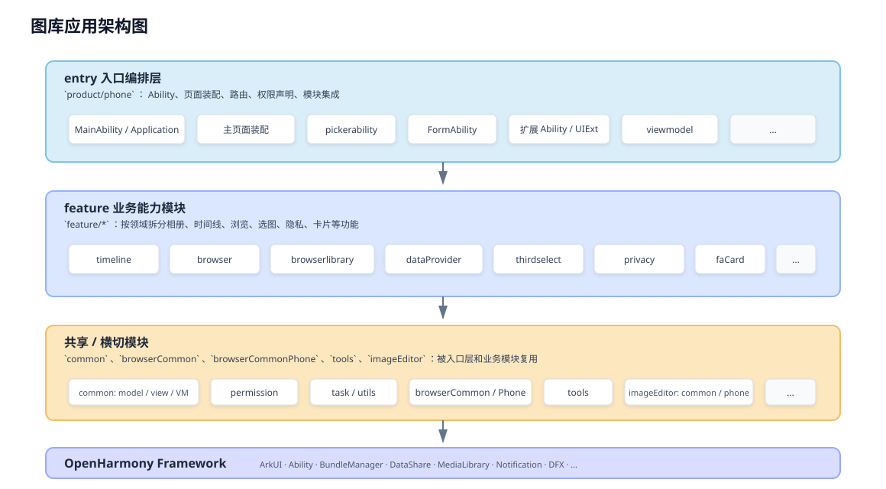

# photos（图库）

## 介绍

图库应用是 OpenHarmony 标准系统中预置的系统应用，为用户提供基础的图库能力，主要包括：相册宫格与时间线浏览、照片/大图浏览（含增强能力）、静态图片编辑（含接续编辑、一键还原、对比与基础编辑）、PhotoPicker、服务卡片、设置与隐私声明、开源资料与扩展能力等。

## 核心功能

1. **首页图片视图**：支持按相册宫格、时间线等方式浏览照片与视频，提供图库主入口的基础浏览能力；包括普通日视图查看、滚动查看、单击状态栏回到顶部、顶部多选按钮、长按多选等交互，同时支持删除、全选、滑动多选、移动到相册等宫格操作，以及幻灯片播放时长等相关设置。
2. **照片 / 大图浏览**：支持大图标题展示与沉浸式浏览体验，提供滑动切换、双击放大、双指旋转、下拉返回、上滑查看详情等手势操作；同时支持收藏、编辑、删除等大图菜单能力，以及移动相册、播放幻灯片、设置壁纸、重命名等顶部操作入口。
3. **视频播放**：支持视频的播放、暂停、静音播放、seek 播放、拖动进度条、倍速播放和横竖屏切换，满足图库场景下对短视频和本地视频内容的基础播放需求。
4. **相册操作**：支持展示预置相册与最近删除页面，创建相册、重命名、删除、添加照片、相册内照片排序等常用相册管理能力，并提供最近删除页面，清空删除、还原。
5. **静态图片编辑**：支持基础编辑、剪裁、调节、标注、马赛克、保存、对比、撤销恢复、一键复原等能力，满足用户对静态图片的常见编辑与修复需求。
6. **PhotoPicker 选图**：支持 PhotoPicker 自定义，提供单选、多选、相册切换、大图视频预览、选择顺序、最新照片 / 视频、拍摄入口、原图选择、文件格式、数量等能力，便于在系统与三方场景下完成灵活选图。
7. **桌面卡片**：支持在桌面展示图片，提供卡片编辑页面，并支持选择单张图片或者相册内容进行展示，方便用户在桌面快速查看图库内容。
8. **适配**：支持图库旋转、深色模式、三方应用图片保存到图库等能力，提升图库在不同系统特性和跨应用场景下的兼容性与体验一致性。

## 软件架构

本工程为 **多模块 HAP/HSP 形态** 的 ArkTS 应用，由 `build-profile.json5` 统一编排各子模块。

### 手机端在整体架构中的位置

- **手机入口 HAP**：`product/phone` 模块类型为 `entry`（工程内模块名 `phone_photos`），声明主 Ability、页面路由、权限与对其它 HSP/HAR 的依赖；日常「图库」App 的主进程与主界面逻辑由此进入。
- **业务能力分层**：具体相册/时间线/大图/选图等能力多数实现在 `feature/*` 与 `common` 中；入口模块通过 **ohpm 本地依赖** 引用 `@ohos/common`、`@ohos/browserlibrary` 等包（构建时由 `oh-package.json5` 与模块依赖解析），保持入口轻薄、特性可复用。
- **手机端浏览适配**：`browserCommon` 提供跨端浏览公共逻辑；**手机专用差异**集中在 `browserCommonPhone`（例如布局、手势、控制器在手机上的装配），与 `feature/browser`、`feature/browserlibrary` 协同。
- **手机端图片编辑**：静态编辑主路径在 `imageEditor` 子工程中；手机产品形态对应 `imageEditor/product/editor_phone`，与 `imageEditor/common`（算法/SDK 桥接等）一起被主应用集成。

### 架构图

- `product/phone` 作为 **entry 入口层**，负责 Ability、页面装配、路由、权限声明与模块集成；
- `feature/*` 承载 **相册/时间线/浏览/选图/隐私/卡片** 等主要业务能力；
- `common`、`browserCommon`、`browserCommonPhone`、`tools`、`imageEditor` 提供 **公共模型、通用 UI / ViewModel、浏览共用能力、工具与编辑能力**；
- 各模块共同依赖 ArkUI、Ability、DataShare、Media Library 等 **OpenHarmony 系统框架**。



### 其它层次（与手机共用）

- **应用级配置**：`AppScope`（`bundleName`、版本、图标、全局配置等）。
- **公共基础**：`common`（数据模型、权限、任务、通用 UI/VM）；`tools`（通用工具）。
- **特性模块目录**：`feature` 下按域拆分，如 `browser`、`browserlibrary`、`timeline`、`dataProvider`、`thirdselect`、`formAbility`、`faCard`、`extensions`、`privacy` 等。
- **构建与签名**：根目录 `hvigorfile.ts`、`hvigor/`；`signature/`

---

## 目录说明

### 1. 工程根目录（手机开发最常打开的层级）

```
applications_photos/
├── AppScope/                      # 应用级 app.json5 等（包名、版本、图标）
├── product/phone/                 # 手机 entry：主 HAP、Ability、主页面入口
├── common/                        # 全局公共：模型、权限、视图与 VM 等
├── feature/                       # 各业务特性 HSP/HAR（浏览、时间线、选图、隐私…）
├── browserCommon/                 # 浏览公共逻辑
├── browserCommonPhone/            # 手机端浏览差异与控制器等
├── imageEditor/                   # 图片编辑子工程（含 editor_phone）
├── tools/                         # 工具模块
├── demo/                          # 示例工程（如 PhotoPicker demo）
├── signature/                     # 签名证书与 profile（按环境配置，勿泄露）
├── hvigor/hvigorfile.ts           # Hvigor 构建配置
├── build-profile.json5            # 全工程模块、SDK、签名方案
└── oh-package.json5               # 根依赖（如 hypium）；各子模块另有独立 oh-package.json5
```

### 2. 手机入口模块 `product/phone`

手机用户安装的图库主应用，对应本目录编译出的 **entry HAP**。源码主路径：`product/phone/src/main/`。

```
product/phone/src/main/
├── module.json5                           # 模块类型 entry、mainElement、权限、依赖的 HSP 等
├── resources/                             # 本模块字符串、媒体、主题、页面 profile（如 main_pages）
└── ets/
    ├── Application/                       # AbilityStage 等应用级生命周期
    ├── MainAbility/                       # 主界面：相册 Tab、宫格、时间线入口、大图容器等
    │   ├── MainAbility.ets
    │   ├── PrivacyStatementAbility.ets    # 隐私声明相关页面 Ability
    │   └── view/                          # 主流程页面与子组件（宫格、时间线 Loader、PhotoBrowser 等）
    ├── FormAbility/                       # 服务卡片 / 桌面卡片：卡片 UI、编辑页、多尺寸 Widget
    ├── pickerability/                     # 系统选图 / PhotoPicker：Picker 扩展页、授权与警告页等
    ├── RecentAbility/                     # 「最近」类选图/展示扩展（含 Recent UIExtension）
    ├── DeleteAbility/                     # 删除相关 UIExtension 与页面
    ├── SaveAbility/                       # 保存相关 UIExtension 与页面
    ├── DefaultAlbumNameAbility/           # 默认相册命名等 UIExtension
    ├── galleryCleanupAbility/             # 图库清理（照片/视频清理入口与网格页等）
    ├── SettingCardDataShareAbility/       # 与设置卡片数据共享相关 Ability
    ├── AuthExtension/                     # 鉴权扩展 Ability
    ├── BackupExtension/                   # 备份扩展
    ├── MusicAbility/                      # 音乐类服务桩（与媒体场景协同）
    ├── viewmodel/                         # 入口模块内的页面级 VM（如各相册页 AppBarManager）
    └── resources/                         # 模块内嵌资源（如 lottie/json）
```

### 3. 公共模块 `common`

路径：`common/src/main/ets/`。手机端大量页面与逻辑依赖此处的模型与组件。

```
common/src/main/ets/
├── default/                       # 主业务代码根
│   ├── model/                     # 媒体项、相册、浏览等数据模型（如 browser/photo）
│   ├── view/viewmodel/            # 可复用 UI 与状态管理
│   ├── permission/                # 权限申请与说明封装
│   ├── task/                      # 异步任务、调度相关
│   ├── utils/access/config/       # 工具、访问封装、配置
│   └── interface/                 # 对外或模块间接口定义
```

### 4. 特性模块 `feature/*`

路径：`feature/<模块名>/src/main/ets/`。下列为手机图库**常见关联模块**

| 目录 | 手机端典型职责 |
|------|------------------|
| `feature/browser` | 图库内「浏览」相关实现与默认打包逻辑 |
| `feature/browserlibrary` | 可被其它应用依赖的浏览库（入口 HAP 在 `module.json5` 中声明依赖） |
| `feature/timeline` | 时间线视图、相册宫格子能力（含 albumgrid、photogrid 等子目录） |
| `feature/dataProvider` | 媒体数据对外提供（系统图库数据通道相关） |
| `feature/thirdselect` | 三方应用选图、与系统选择器协同 |
| `feature/formAbility` | 与表单/扩展 Ability 相关的特性侧实现（与 `product/phone` 中 Form 协同） |
| `feature/faCard` | 服务卡片数据与逻辑 |
| `feature/privacy` | 安全与隐私（安全中心、隐私声明能力等） |
| `feature/extensions` | 扩展点聚合 |

### 5. 浏览公共层 `browserCommon` 与 `browserCommonPhone`

- **`browserCommon`**：跨设备浏览共用逻辑（组件、管线等，具体见该模块 `src/main/ets`）。
- **`browserCommonPhone`**：手机端专用控制器、布局或交互差异（当前可见如 `controller` 子目录）；与 `feature/browserlibrary` 中控制器配合完成大图体验。

### 6. 手机端图片编辑 `imageEditor`

```
imageEditor/
├── common/                        # 编辑内核侧公共代码、Native/桥接等（模块 editor_common）
└── product/
    └── editor_phone/              # 手机编辑器产品：页面与组件（如 component/）
```

## 相关仓

- https://gitcode.com/openharmony/applications_photos
