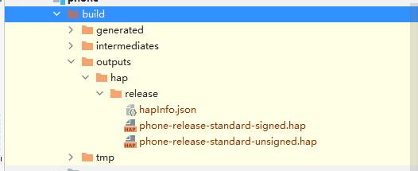
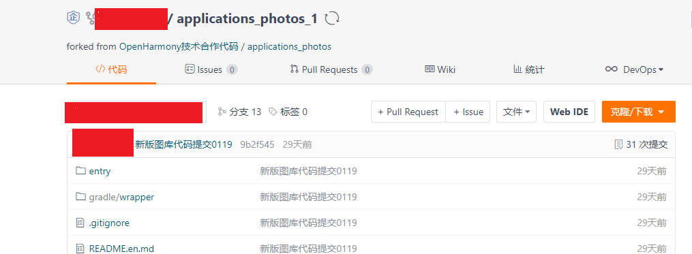
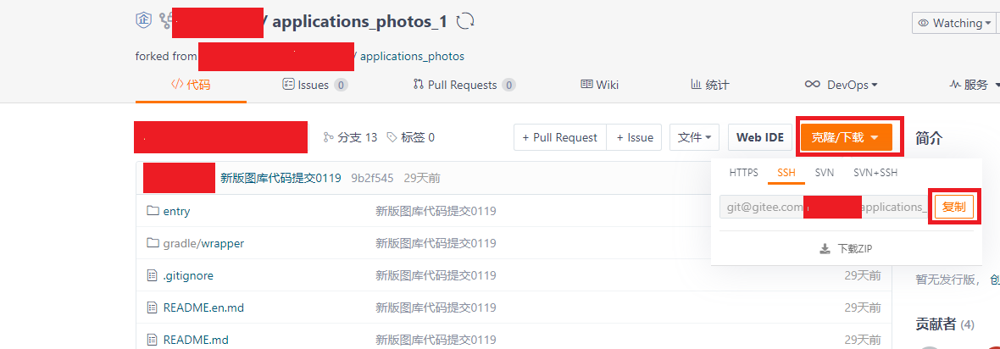
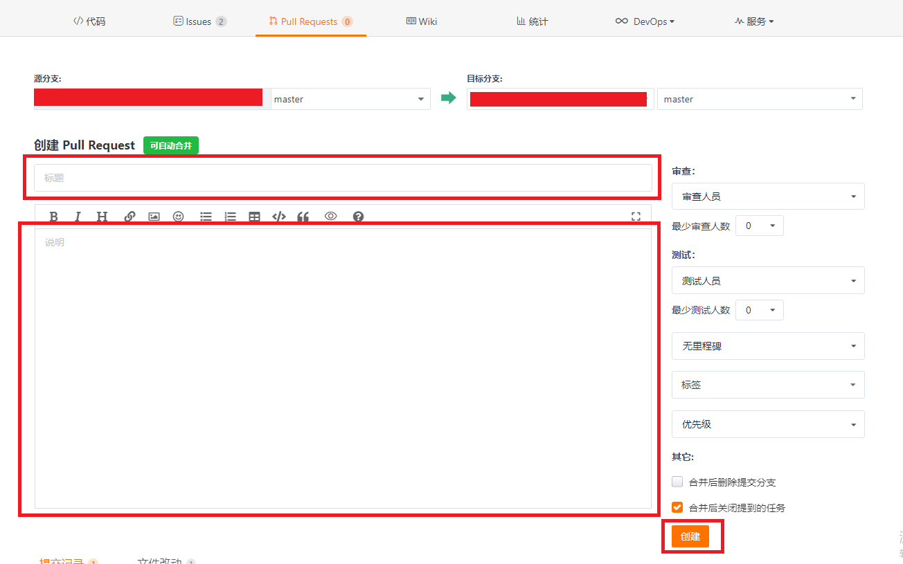

# 图库源码开发说明
## 1. 简介
图库是系统内置的可视资源访问应用，提供图片和视频的管理、浏览、显示、编辑操作等功能，并支持默认相册和用户相册管理。  
图库项目采用 TS 语言开发。


图库整体以 OpenHarmony 既有的 MVVM 的 App 架构设计为基础，向下扩展出一套 MVP（View, Presenter, Model）分层架构（既有的 MVVM 框架整体理解为新扩展的 MVP 框架的 View 层），用于处理图库的业务逻辑与数据管理。

各层的作用分别如下：

- 视图层（View）：负责更新 UI 显示以及触摸与点击事件的监听。
- 展现层（Presenter）：负责处理视图层（View）发送的业务逻辑处理请求，并连通 Model 层获取数据。
- 模型层（Model）：负责处理展现层（Presenter） 中关于数据处理的请求以及返回数据请求结果。

应用各层中重要类及其功能如下表所示

| 模块   | 层级   | 类名                     | 作用                                 |
| ------ | ------ | ------------------------ | ------------------------------------ |
| photos | 视图层 | phone.view.Index         | phone图库入口画面的视图层逻辑控制类  |
| photos | 视图层 | pad.view.Index           | pad图库入口画面的视图层逻辑控制类    |
| photos | 视图层 | TimelinePage             | 图库图片视图层逻辑控制类             |
| photos | 视图层 | AlbumSetPage             | 图库相册视图层逻辑控制类             |
| photos | 视图层 | PhotoBrowser             | 图库大图浏览视图层逻辑控制类         |
| photos | 视图层 | PhotoGridPage            | 图库宫格视图层逻辑控制类             |
| photos | 视图层 | ThirdSelectAlbumSetPage  | 图库三方选择相册视图层逻辑控制类     |
| photos | 视图层 | ThirdSelectPhotoGridPage | 图库三方选择宫格视图层逻辑控制类     |
| photos | 视图层 | ThirdSelectPhotoBrowser  | 图库三方选择大图浏览视图层逻辑控制类 |
| photos | 展现层 | PhotoDataSource          | 图库列大图浏览展现层数据逻辑类       |
| photos | 展现层 | TimelineDataSource       | 图库日试图展现层数据逻辑类           |
| photos | 展现层 | AlbumSetDataSource       | 图库相册展现层数据逻辑类             |
| photos | 展现层 | MediaDataSource          | 图库宫格展现层数据逻辑类             |
| photos | 展现层 | TimelineSelectManager    | 图库日试图展现层选择逻辑类           |
| photos | 展现层 | ThirdSelectManager       | 图库三方选择展现层选择逻辑类         |
| photos | 展现层 | AlbumSetSelectManager    | 图库相册展现层选择逻辑类             |
| photos | 展现层 | SelectManager            | 图库展现层选择逻辑类                 |
| photos | 展现层 | BroadCast                | 图库展现层消息分发类                 |
| photos | 模型层 | AlbumInfo                | 图库模型层相册信息类                 |
| photos | 模型层 | MediaItem                | 图库模型层媒体信息类                 |
| photos | 模型层 | Thumbnail                | 图库模型层媒体缩略信息类             |


## 2. 目录

```
/applications
├── src
│   └── main
│       ├── ets    # ets代码目录
│           ├── MainAbility
│               ├── common # 共同代码目录
│ 					├── access # 媒体库接口目录
│ 					├── model # model目录
│						├── browser # 浏览model目录
│							├── album # 相册model目录
│							├── dataObserver # 数据注册model目录
│							├── interface # 接口model目录
│							├── operation # 操作项model目录
│							└──	photo # 照片model目录
│						└── common #共同业务逻辑和实体模型目录
│ 					├── utils # 共同工具目录
│ 					└──  view # 共同视图组件
│ 						├── actionbar 共同标题栏、底层栏和工具栏组件目录
│						├── dialog 共同对话框目录。
│                       └── mediaOperation 共同相册选择页目录
│               ├── feature # 功能模块目录
│                   ├── brower # 图库浏览功能目录
│  						├── utils # 图库浏览工具目录
│  						└──	view # 图库浏览视图目录
│							├── album # 相册视图目录
│							├── photo # 照片视图目录
│							└── photoGrid # 照片宫格目录
│                   ├── thirdSelect # 第三方选择功能目录
│ 						├── utils # 第三方选择工具目录
│						└──	view # 第三方视图目录
│                   └── timeline # 日视图宫格功能目录
│  						├── model # 日视图model目录
│ 						├── utils # 日试图工具目录
│ 						└── view # 日试图视图目录
│               ├── product # 产品模块目录
│                   ├── pad # pad模块目录
│   					└── view # pad模块视图目录
│                   └── phone # phone模块目录
│  						└── view # phone模块视图目录
│       ├── resources    # 资源目录
│       └── config.json    # 项目配置信息
```
### 

## 3. 基础开发说明
### 资源引用
#### 定义资源文件
- 在 `src/main/resources/`目录下，根据不同的资源类型，定义资源文件。

  ```json
      {
        "name": "default_background_color",
        "value": "#F1F3F5"
      },
  ```
#### 引用资源
- 在有对应page的ets文件中，可直接通过`$r()`引用。
  ```` JavaScript
  @Provide backgroundColor: Resource = $r('app.color.default_background_color');
  ````
## 4. 典型接口的使用
1. 相机启动图库大图浏览

   ```
   this.context.startAbility({
     bundleName:"com.ohos.photos",
     abilityName: "com.ohos.photos.MainAbility",
     parameters: {
       uri: "photodetail"
     }
   }).then((data) => {
     console.debug('startAbility complete');
   }).catch((error) => {
     console.debug(`startAbility failed, error: ${JSON.stringify(error)}`);
   })
   ```

2. 三方应用启动图库三方单选

   ```
   let startParmameter = {
     bundleName:"com.ohos.photos",
     abilityName: "com.ohos.photos.MainAbility",
     parameters: {
       uri: "singleselect"
     }
   };
   this.context.startAbilityForResult(startParmameter).then((result) => {
     console.info(`startAbilityForResult Promise.resolve is called, result.resultCode =  ${JSON.stringify(result)}`)
     let want = result['want'];
     console.info(`test select single ${JSON.stringify(want)}`);
     if (want != null && want != undefined) {
       let param = want['parameters'];
       console.info(`test select single ${JSON.stringify(param)}`);
       if (param != null && param != undefined) {
         let uri = param['select-item-list'];
         console.info(`test select single ${uri}`);
       }
     }
   }, (error) => {
     console.info(`startAbilityForResult Promise.Reject is called, error.code = ${error.code}`)
   })
   ```

3. 三方应用启动图库三方多选

   ```
   let startParmameter = {
     bundleName:"com.ohos.photos",
     abilityName: "com.ohos.photos.MainAbility",
     parameters: {
       uri: "multipleselect"
     }
   };
   this.context.startAbilityForResult(startParmameter).then((v) => {
     let want = v['want'];
     console.info(`test select multiple ${want}`);
     if (want != null && want != undefined) {
       let param = want['parameters'];
       console.info(`test select multiple ${param}`);
       if (param != null && param != undefined) {
         let uri = param['select-item-list'];
         console.info(`test select multiple ${uri[0]} ${uri[1]}`);
       }
     }
   }, (error) => {
     console.debug(`startAbility failed, error: ${JSON.stringify(error)}`);
   })
   ```

## 5. 签名打包
### 签名
#### 签名文件的获取
1. 拷贝 OpenHarmony 标准版的 prebuilts\signcenter 目录到操作目录。
2. 拷贝图库工程的 signature\photos.p7b 到该目录下。

备注：如果需要生成并使用自己的签名文件可参考https://gitee.com/openharmony/docs/blob/master/zh-cn/application-dev/quick-start/configuring-openharmony-app-signature.md

#### 签名文件的配置
打开项目工程，选择 File → Project Structure


选择 Modules → Signing Configs，将对应的签名文件配置如下，完成后点击Apply，再点击OK。
密码为生成签名文件时的密码，如果使用默认的签名文件，则使用默认密码123456。


配置完成后，对应的build.gradle文件中会出现如下内容


### 打包
DevEco Studio 支持 debug 与 release 两种打包类型。可以在 OhosBuild Variants 窗口中进行切换。

 

#### release打包
1. 代码准备完成后，在 OhosBuild Variants 窗口的 Selected Variant 中选择 release   

    

2. 选择Build → Build Haps(s)/APP(s) → Build Hap(s)

   

3. 编译完成后，hap包会生成在工程目录下的 `\build\outputs\hap\release\`路径下（如果没有配置签名，则只会生成未签名的hap包）

   


## 6. 安装、运行、调试
### 应用安装
配置 hdc：
进入SDK目录中的toolchains文件夹下，获取文件路径：


并将此路径配置到环境变量中：


连接开发板，打开一个新的cmd命令窗口，执行`hdc list targets`，弹出窗口如下：


等待一段时间后，窗口出现如下打印，可回到输入 hdc list targets 的命令窗口继续操作:


再次输入hdc list targets，出现如下结果，说明hdc连接成功


获取 root 权限与读写权限：

```
hdc target mount
```

变更根目录读写权限

```
hdc shell "mount -o remount,rw /"
```

将签名好的 hap 包放入设备的 `/system/app/包名` 目录下，并修改hap包的权限。删除和发送文件命令如下：

```
hdc file send 本地路径 /system/app/包名/hap包名称
```
例：将当前本地目录的 `Photos.hap` 文件放入到 `system/app/com.ohos.photos/Photos.hap` 文件中。
```
hdc file send Photos.hap /system/app/com.ohos.photos/Photos.hap
```
> 注意，如果设备不存在 `/system/app` 目录，则需要手动创建该目录并修改权限。
> ```
> hdc shell
> cd system
> mkdir app
> chmod 777 app
> ```
> `/system/app` 目录放置系统应用，例如：Photos，SystemUI，Settings 等。
>
> 但hap包需要在该目录下手动设置权限
> ```
> chmod 666 hap包名
> ```
> 此目录应用不用手动安装，系统自动拉起。
### 应用运行
图库属于系统应用，在将签名的 hap 包放入 `/system/app` 目录后，重启系统，应用会自动拉起。
```
hdc_std shell "reboot"
```
> 注意，如果设备之前安装过系统应用，则需要执行如下几条命令清除设备中存储的应用信息才能够在设备重启的时候将我们装入设备的新 hap 包正常拉起。
> ```
> hdc_std shell "rm /data/* -rf"
> hdc_std shell "sync"
> hdc_std shell "/system/bin/udevadm trigger"
> ```
### 应用调试
#### log打印
- 在程序中添加 log
```JS
private log: Logger = new Logger('MoudleXXX')

entry() {
    let input = 'hello'
	this.log.info(`entry: ${input}`)
}
```
上述log打印为：

```
Photos_MoudleXXX:entry: hello
```

可以在DevEco Studio中查看log


#### log获取及过滤
- log获取


将log输出至文件  
```
hdc shell hilog > 输出文件名称
```

例：
在真实环境查看log，将全log输出到当前目录的hilog.log文件中
```
hdc shell hilog > hilog.log
```

- log过滤

在命令行窗口中过滤log
```
hilog | grep 过滤信息
```

例：过滤包含信息 Album的 hilog
```
hilog | grep Album
```
## 7. 贡献代码
### Fork 代码仓库
1. 在码云上打开 photos代码仓库（[仓库地址](https://gitee.com/OHOS_STD/applications_photos)）。
2. 点击仓库右上角的 Forked 按钮
   
3. 在弹出的画面中，选择将仓库 fork 到哪里，点击确认。
   
4. Fork 成功之后，会在自己的账号下看见 fork 的代码仓库。
   

### 提交代码
1. 访问我们自己在码云账号上 fork 的代码仓库，点击“克隆/下载”按钮，选择 SSH，点击“复制”按钮。
   

2. 在本地新建 Photos 目录，在 Photos 目录中执行如下命令
   ```
   git clone 步骤1中复制的地址
   ```

3. 修改代码。

   > 将代码引入工程，以及编译工程等相关内容请参见 **3. 代码使用** 部分的相关内容。
4. 提交代码到 fork 仓库。  
   > 修改后的代码，首先执行 `git add` 命令，然后执行 `git commit` 命令与 `git push` 命令，将代码 push 到我们自己的 fork 仓中。
   > 关于代码提交的这部分内容涉及 git 的使用，可以参照 [git官网](https://git-scm.com/) 的内容，在此不再赘述。

### 发起 Pull Request (PR)
在将代码提交到 fork 仓之后，我们可以通过发起 Pull Request（PR）的方式来为 OpenHarmony 的相关项目贡献代码。

1. 打开 fork 仓库。选择 `Pull Requests` → `新建 Pull Request`

   

2. 在 `新建 Pull Request` 画面填入标题与说明，点击 `创建` 按钮。

   
3. 创建 Pull Request 完成。 PR 创建完成后，会有专门的代码审查人员对代码进行评审，评审通过之后会合入相应的代码库。

   


